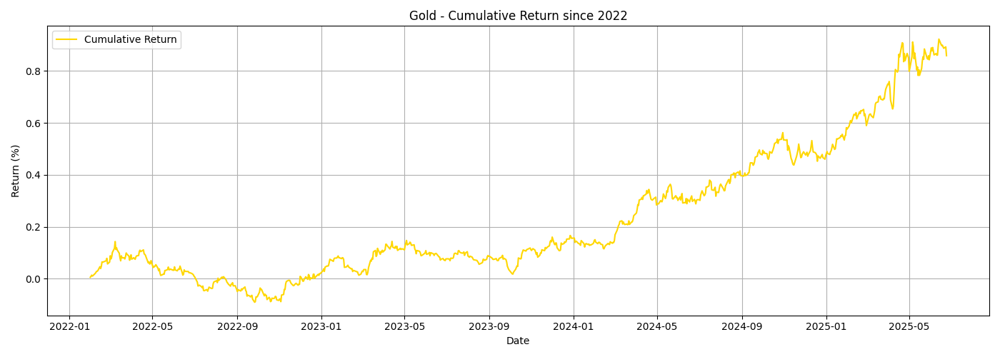
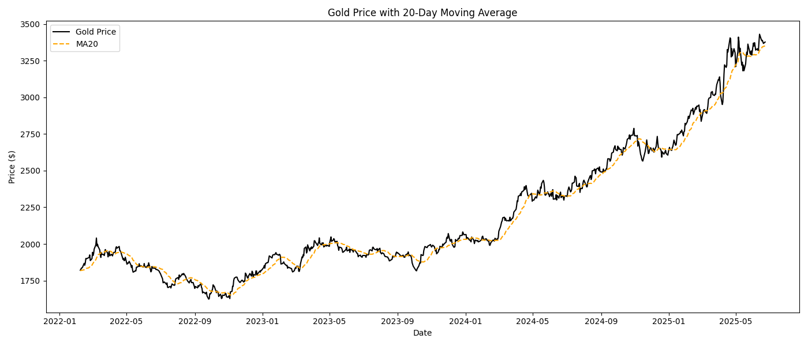
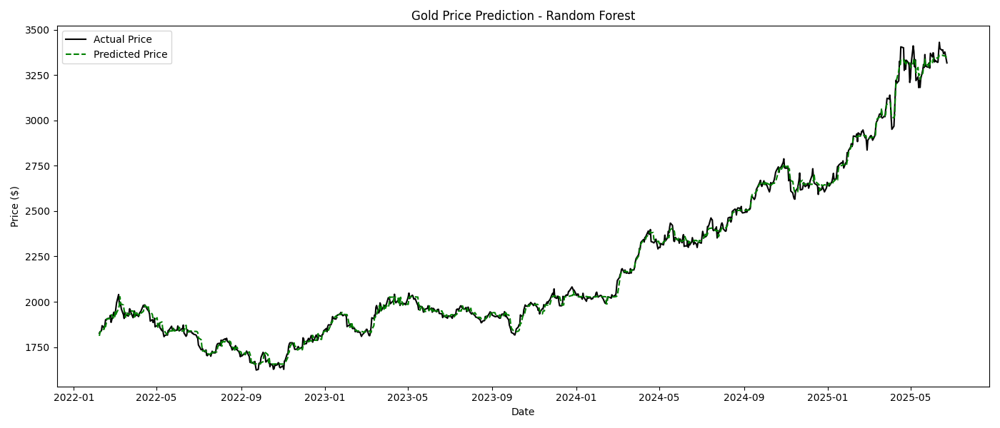

# 🧠 Gold Price Analysis & Forecasting with Random Forest

This project performs a complete pipeline of financial time series analysis on **Gold Futures (GC=F)** using historical data from Yahoo Finance.

## 🔍 Project Highlights

- ✅ Data collection via the `yfinance` API
- 📊 Statistical analysis:
  - Cumulative return
  - Annualized volatility & return
  - Rolling moving average
  - Price/MA20 correlation
- 🌲 Machine Learning:
  - Random Forest Regressor
  - `GridSearchCV` hyperparameter tuning
- 📈 Visualizations of historical performance & model predictions

## 📌 Key Results

| Metric                | Value     |
|----------------------|-----------|
| Cumulative Return     | ~85.86%   |
| Annualized Return     | ~19.54%   |
| Annualized Volatility | ~15.64%   |
| Model R² Score        | ~99.73%   |

## 🧰 Technologies Used

- Python 3.x
- [yfinance](https://pypi.org/project/yfinance/)
- pandas
- scikit-learn
- matplotlib

## 📈 Visualisations

### 1. Cumulative Return since 2022


### 2. Gold Price with 20-Day Moving Average


### 3. Gold Price Prediction - Random Forest



## 🚀 Run it yourself

1. **Install dependencies**:

```bash
pip install yfinance pandas scikit-learn matplotlib


